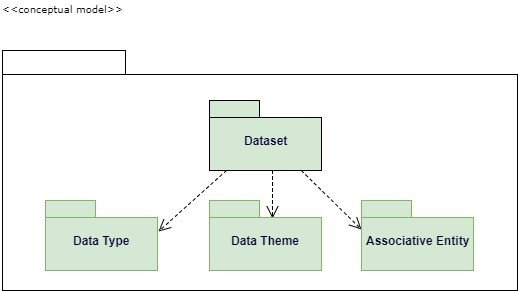

# Data Analyst Internship
 MTC Spatial Data Modeling Research and Data Internship  

This folder contains work products and research conducted by the 2017 Summer Intern  

## Repo Contents   

### Table of Content
 <ul>
 <li>Executive Summary</li>
 <li>Approach Plan</li>
 <li>Results</li>
 <li>Conceptual Model Development Draft</li>
 <li>Conclusion</li>
 <li>Case Studies</li>
</ul>

**************
### Executive Summary
**************
<table>
<tr><td>Integrated Planning Section at MTC uses and maintains an extensive variety of data that is used to support growing number of projects and initiatives. Currently the data is spread between several databases, shared drives, box and personal drives in many different formats.  “By 2020 IDC” [International Data Corporation] “predicts the amount of digital information will grow by a factor of 30, the number of files, by a factor of 60”. MTS’s N-drive alone is holding more than half a million files and folders containing more the 60,000 datasets. Furthermore, “IDC surveys find that the time spent searching for information averages 8.8 hours per week.” The integrated planning section typically invest significant amount of time searching for data relevant to a particular project, initiative or task, as well as hire outside consultants to provide that data. The goal of this Analytical Services Internship was to work with staff to develop a strategy for data discovery within the planning groups of the Air District, MTC and its transitional employees. The solution design is not to drastically change how things are done, but rather to improve and streamline the process with clear understanding of rules when it comes to data methodology to eliminate time, effort and cost spend on finding relevant data and greatly enhance the efficiency of the unit.</td></tr></table>

***********
### Approach Plan
***********
<ul>
<li>Interview with the Head of the Department and at least one main Power Users to understand the need</li> 
<li>Schedule 15-30 minutes one-on-one interviews with the main data users to understand how they use data</li> 
<li>Analyze responses from one-on-one interviews to draw conclusions on the initial questions and methods to gather information about datasets</li> 
<li>Investigate option for publishing survey: google forms, survey monkey, in-house webform</li>
<li>Design and Build Survey Form</li>
<li>Sent out initial survey as an in-house web form and as excel template providing incentive such as prize to complete with in shorter timeframe</li>
<li>Schedule short one-on-one interviews with all users that didn’t respond to the survey</li> 
<li>Gather and document feedback on the Initial Data Survey</li> 
<li>Analyze at least one source of data files that participants frequently referred to as location to evaluate whether or not comprehensive inventory of all data files/datasets is valuable</li>
<li>Draw Conceptual Data Model </li>
<li>Suggetions for Data Audit Form</li>
<li>Write up Data Strategy Document</li>
<li>Finalized the project</li>
</ul>

 Webform http://datasurvey.mtcanalytics.org/

***********
### Results
***********
</img>  

***********
### Conceptual Data Model Draft
***********
  
 </img>

***********
### Conclusion
***********
Draft: With the information gathered via web survey, excel template, emails, in-person interviews and "drive-by"s it can be concluded that due to high volume of existing data and tasks it would be beneficial to have a mandatory Comprehensive Data Audit (not a survey where participation is voluntary) performed with the help of a Data Team. It is highly advisable to develope a clear and comprehensive Data Governance Model with on the entire organizations, that will help eliminate major cause of confusion when it comes to Data Quality Management, Data Development, Document and Content Management as well as Data Security and Operations Management. Quality Data Governance Policy will also elimante skeptisism and increase data integrity.

***********
### Case Studies
***********

US Open Data Initiative
Massachusetts Department of Transportation  
City of San Francisco  
United States Department of Transportation  
U.S. General Services Administration, Technology Transformation Service  
National Aeronautics and Space Administration  
Federal Geographic Data Committee  
Valley Transportation Authority  
State of New York Open Data  
State of California Open Data  
Chicago Regional Transportation Authority  
Rudin Center for Transportation Policy and Management  
LA Open Data  
