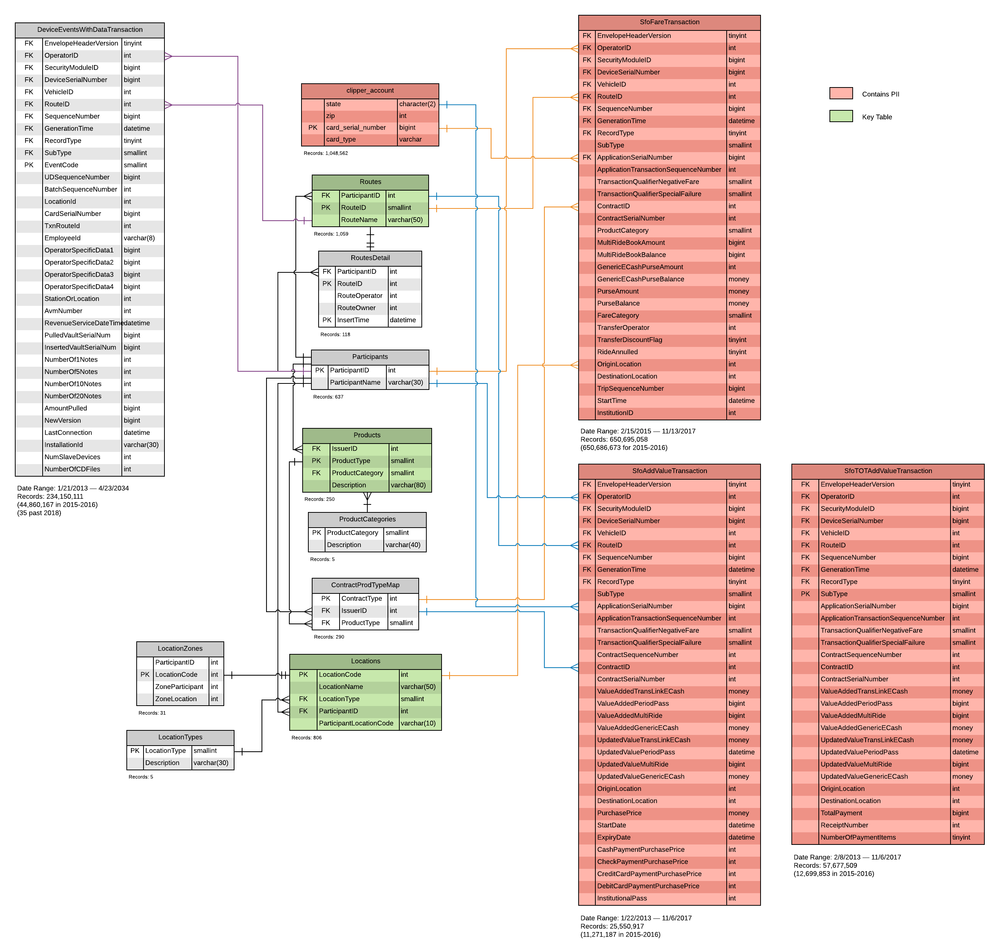

<!-- MarkdownTOC bracket="round" autolink="true"  -->

- [Goal](#goal)
- [Goal](#goal-1)
- [Overview](#overview)
    - [Entity Relationship Diagram](#entity-relationship-diagram)
    - [Tables](#tables)

<!-- /MarkdownTOC -->

# Goal

Document anonymized clipper tables on the datalake. 

# Goal

One of the key lessons learned from the [usf-practicum](https://github.com/BayAreaMetro/usf-practicum) was that the data lake tables need to be more fully documented in order to ease ad-hoc analytical work on clipper data. 

The primary goal of this directory is to:
* document tables and variable names  
* document relationships between tables  
* note idiosyncrasies of the data (missing values, etc)  

# Overview

## Entity Relationship Diagram

## Tables

- [sfofaretransaction](sfofaretransaction.md) - this is the main table of transactions
- [products](products.md) - this table provides metadata on products that can be joined to transactions  

## Attributes

When the attributes of a given table must be understood in more detail for a given analysis, we can track the meaning that particular values take in the context of an analysis below:

