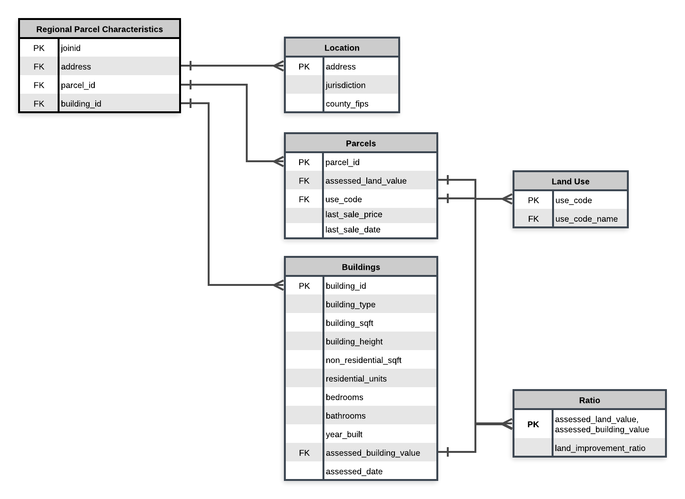
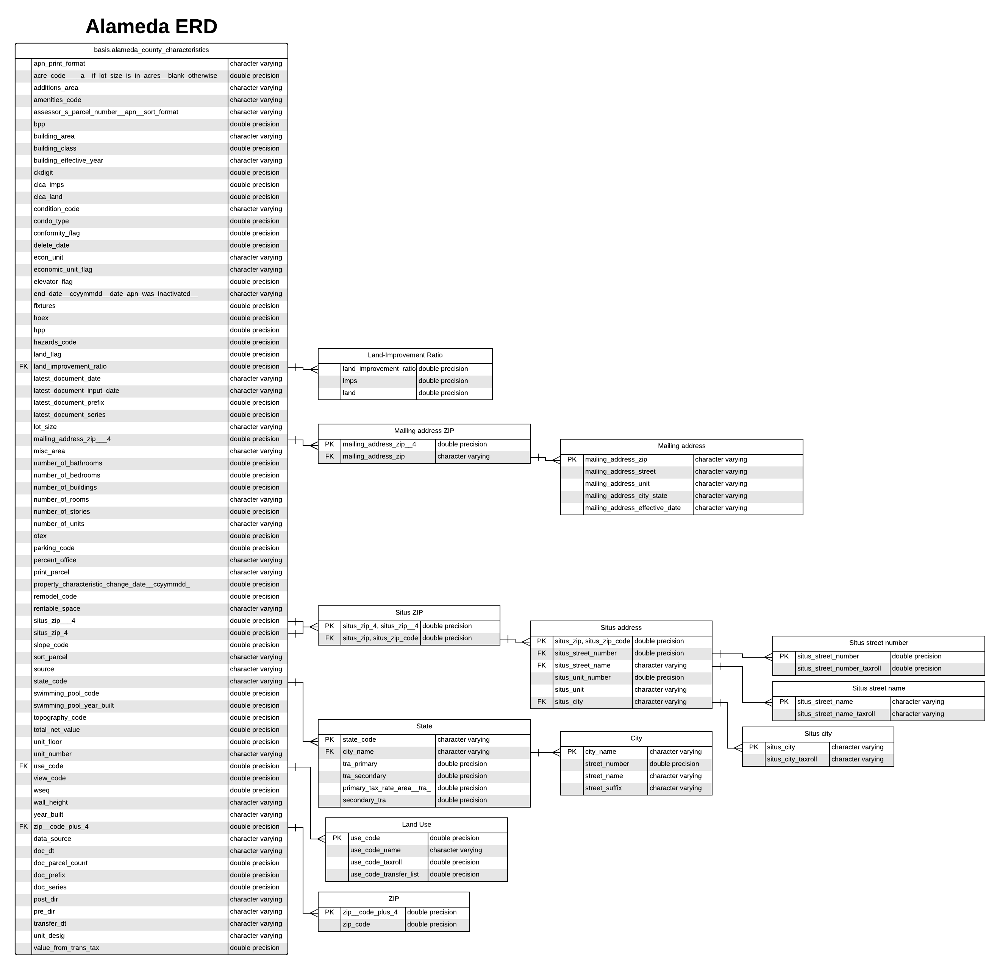
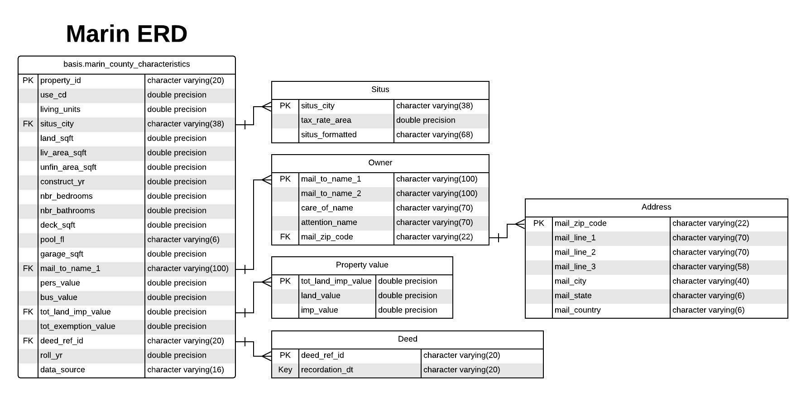
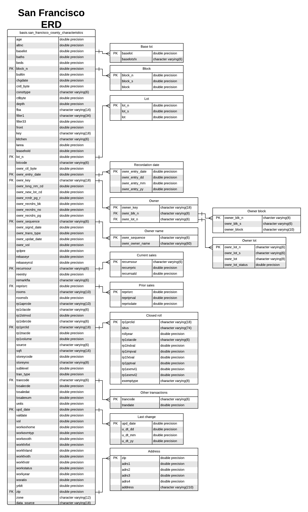
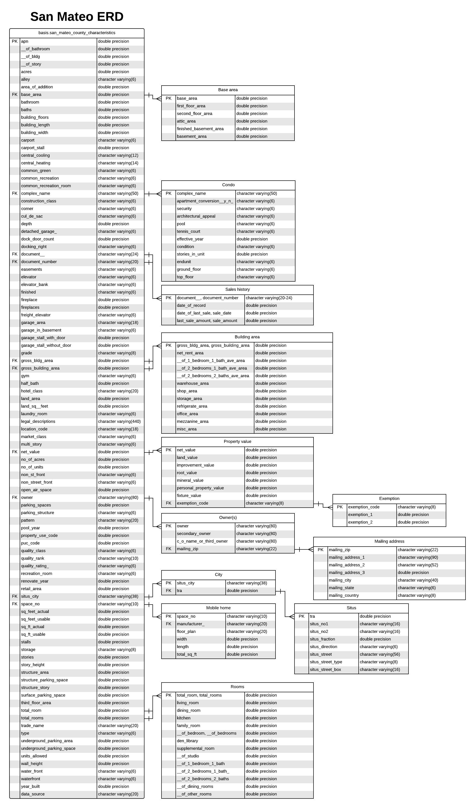
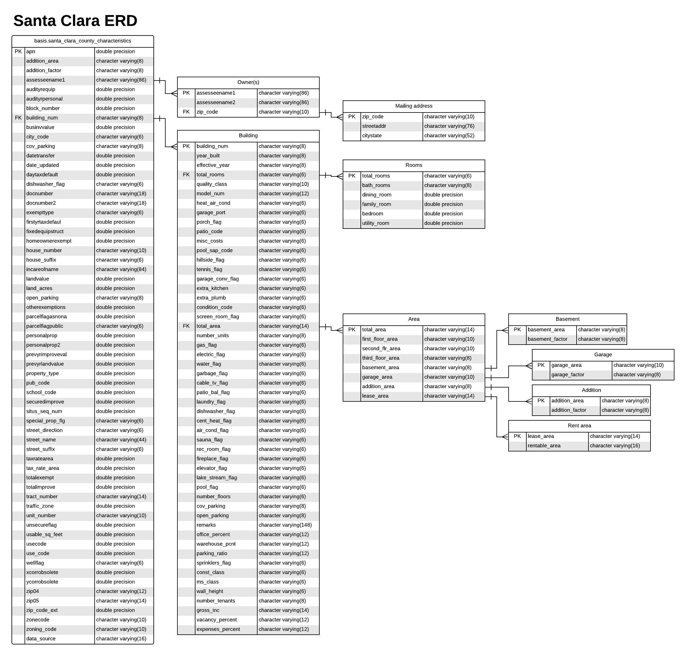
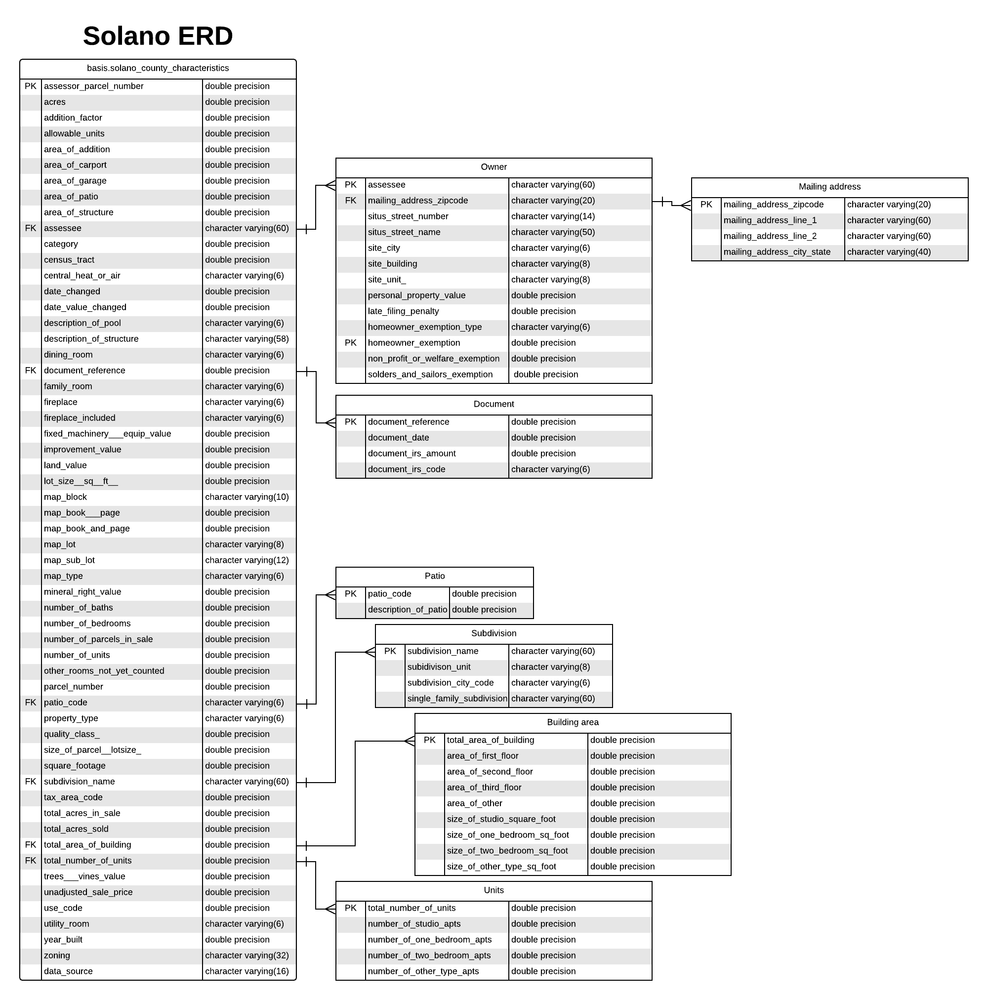
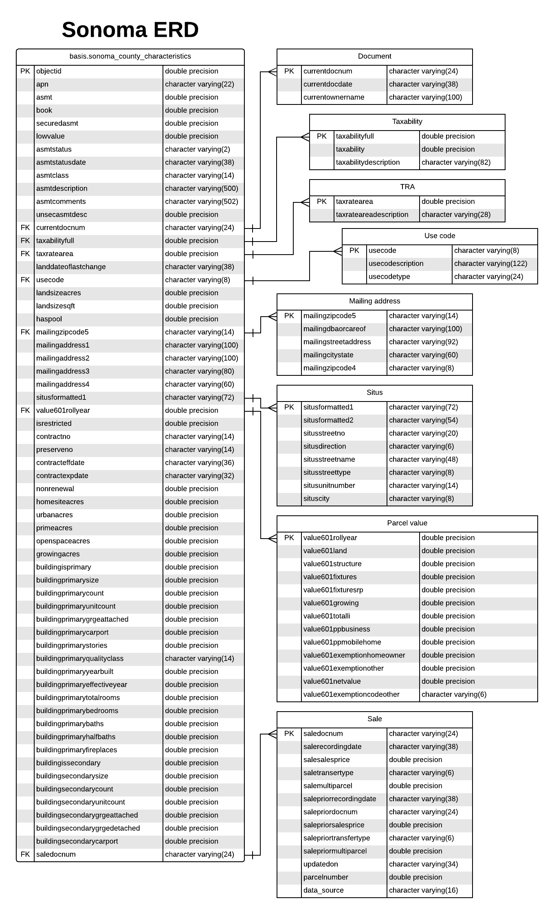

-Draft-

# Regional Parcel Characteristics

### Description, Purpose, and Use
This documentation provides a high-level overview of the Regional Parcel Database's wide variety of fields. These fields describe characteristics of the region's parcels including -- but not limited to -- land use, building characteristics, and monetary value. These characteristics are used in MTC/ABAG land use modeling, housing policy, and long range planning research. The database has significant overlap with the UrbanSim Building and Parcels Datasets that are used for Plan Bay Area 2050's UrbanSim models.

### Project Management

- [Asana Project]
- [Box](https://mtcdrive.app.box.com/folder/79744886422)  

### Contents 

- [Field Mapping, Definitions, and Sources](#field-mapping,-definitions,-and-sources)
- [Data Collection](#data-collection)
- [Fields](#methodology)
    - [Alameda County](#alameda-county)
    - [Contra Costa County](#contra-costa-county)
    - [Marin County](#marin-county)
    - [Napa County](#napa-county)
    - [San Francisco (City and County)](#san-francisco-city-and-county)
    - [San Mateo County](#san-mateo-county)
    - [Santa Clara County](#santa-clara-county)
    - [Solano County](#solano-county)
    - [Sonoma County](#sonoma-county)
- [Related Works](#related-works)

## Field Mapping, Definitions, and Sources

**NOTE**: Field documentation available internally at MTC only.

* **Alameda County**
   * [Alameda County Field Mapping](https://github.com/BayAreaMetro/DataServices/blob/master/Project-Documentation/mdm/land-people-mdm/files/Alameda_Buildings_Field_Mapping.csv)
   * [Alameda County Assessor Field Documentation](https://mtcdrive.box.com/s/9nje22hvxgeri0pwb05dd4j0xrhr84mv)
* **Contra Costa County**
   * Contra Costa County Field Mapping (**Not Currently Available**)
   * [Contra Costa County Assessor Field Documentation](https://mtcdrive.box.com/s/65px7q9wzl8ge0pwgjatt0bqyjdtbqjx)
* **Marin County**
   * [Marin County Field Mapping](https://github.com/BayAreaMetro/DataServices/blob/master/Project-Documentation/mdm/land-people-mdm/files/Marin_Buildings_Field_Mapping.csv)
   * [Marin County Assessor Field Documentation](https://mtcdrive.box.com/s/nahof8uz18qzqrl1i7zmzv7by0zqjslm)
* **Napa County**
   * [Napa County Field Mapping](https://github.com/BayAreaMetro/DataServices/blob/master/Project-Documentation/mdm/land-people-mdm/files/Napa_Buildings_Field_Mapping.csv)
   * Napa County Assessor Field Documentaiton (**Not Currently Available**)
* **San Francisco County**
   * [San Francisco County Field Mapping](https://github.com/BayAreaMetro/DataServices/blob/master/Project-Documentation/mdm/land-people-mdm/files/SF_Buildings_Field_Mapping.csv)
   * [San Francisco County Assessor Field Documentation](https://mtcdrive.box.com/s/8xyhr6uicc68be0boyqtv7fvcmun3mue)
* **San Mateo County**
   * [San Mateo County Field Mapping](https://github.com/BayAreaMetro/DataServices/blob/master/Project-Documentation/mdm/land-people-mdm/files/SM_Buildings_Field_Mapping.csv)
   * [San Mateo County Assessor Field Documentation](https://mtcdrive.box.com/s/bai2l1erwum07rwk28dcsy05j4bcnpbo)
* **Santa Clara County**
   * [Santa Clara County Field Mapping](https://github.com/BayAreaMetro/DataServices/blob/master/Project-Documentation/mdm/land-people-mdm/files/SC_Buildings_Field_Mapping.csv)
   * [Santa Clara County Assessor Field Documentation](https://mtcdrive.box.com/s/jd12binabjjnz7bigg50ajubgvgmj6do)
* **Solano County**
   * [Solano County Field Mapping](https://github.com/BayAreaMetro/DataServices/blob/master/Project-Documentation/mdm/land-people-mdm/files/Solano_Buildings_Field_Mapping.csv)
   * [Solano County Assessor Field Documentation](https://mtcdrive.box.com/s/idafksdkt4yv3ekojfnez8j463hlrpmo)
* **Sonoma County**
   * [Sonoma County Field Mapping](https://github.com/BayAreaMetro/DataServices/blob/master/Project-Documentation/mdm/land-people-mdm/files/Sonoma_Buildings_Field_Mapping.csv)
   * [Sonoma County Assessor Field Documentation](https://mtcdrive.box.com/s/oi7065zrci2gu376f45yxa65n0fnwy9o)

## Data Collection  
This dataset was compiled using parcel characteristics data from each of the nine counties' assessor's offices. 

## Fields
**Parcel Regional Characteristics**|**Description**|**Alameda**|**Contra Costa**|**Marin**|**Napa**|**San Francisco**|**San Mateo**|**Santa Clara**|**Solano**|**Sonoma**|**Source**
:-----:|:-----:|:-----:|:-----:|:-----:|:-----:|:-----:|:-----:|:-----:|:-----:|:-----:|:-----:
join\_id|Unique join id which joins buildings to parcels| | | | | | | | | |MTC derived
jurisdiction|City or county (unincorporated area) name|situs\_city|situs\_city\_abbr|situs\_city|situs2| |situs\_city|city\_code|site\_city|situscity|County assessor derived
county\_id|County FIPS code| | | | | | | | | |MTC derived
parcel\_id|County APN|apn|apn|apn|apn|apn|apn|apn|apn|apn|County assessor derived
building\_id|Unique building ID|(Calculated Value) building\_id|(Calculated Value) building\_id|(Calculated Value) building\_id|(Calculated Value) building\_id|(Calculated Value) building\_id|(Calculated Value) building\_id|(Calculated Value) building\_id|(Calculated Value) building\_id|(Calculated Value) building\_id|MTC/County Assessor derived
building\_type|The building type or the primary building type if there are multiple|use\_code|use\_code|use\_cd|usecode| rp1clacde|property\_use\_code|use\_code|use\_code|usecode|County assessor derived
building\_sqft|Square footage of building(s)|building\_area|(Calculated Value) building\_1\_sq\_feet + residence\_2nd\_floor\_sq\_ft + residence\_lower\_level\_sq\_ft|liv\_area\_sqft| | |gross\_bldg\_area|total\_area|total\_area\_of\_building|(Calculated Value) buildingprimarysize + buildingsecondarysize|MTC/County Assessor derived
non\_residential\_sqft|Square footage of non-residential space in building(s)|(Calculated Value) lot\_size - building\_area|(Calculated Value) area - (building\_1\_sq\_feet + residence\_2nd\_floor\_sq\_ft + residence\_lower\_level\_sq\_ft)|(Calculated Value) land\_sqft - liv\_area\_sqft| |sqft|(Calculated Value) sq\_ft\_actual - gross\_bldg\_area|(Calculated Value) usable\_sq\_feet - total\_area| (Calculated Value) lot\_size\_\_sq\_\_ft\_\_ - total\_area\_of\_building|(Calculated Value) landsizesqft - (buildingprimarysize + buildingsecondarysize)|MTC/County Assessor derived
residential\_units|Number of residential units in building(s)| number\_of\_units| total\_rooms| living\_units| | units| no\_of\_units| number\_units|  number\_of\_units|  (Calculated Value) buildingprimaryunitcount + buildingsecondaryunitcount|MTC/County Assessor derived
year\_built|Year building was built or average if multiple|year\_built|year\_built|construct\_yr| |yr\_blt|year\_built|year\_built|year\_built|buildingprimaryyearbuilt|MTC/County Assessor derived
asssessed\_land\_value|Assessor's value of parcel land| land|land\_value|land\_value| currentmarketlandvalue| rp1lndval|land\_value|landvalue|land\_value| value601land|County assessor derived
assessed\_building\_value|Assessor's value of the building(s)|imps|improvement\_value|imp\_value|currentnetvalue| rp1impval|improvement\_value|securedimprove|improvement\_value| value601netvalue|County assessor derived
land\_improvement\_ratio|Assessed land value / Assessed building value| (Calculated Value) land/imps|(Calculated Value) land\_value/improvement\_value|(Calculated Value) land\_value/imp\_value| (Calculated Value) currentmarketlandvalue/currentnetvalue| (Calculated Value) rp1lndval/rp1impval|(Calculated Value) land\_value/improvement\_value|(Calculated Value) landvalue/securedimprove|(Calculated Value) land\_value/improvement\_value| (Calculated Value) value601land/value601netvalue|MTC/County Assessor derived
assessed\_date|Date on which assesment occurred|doc\_dt| | | | valdate| | date\_updated| |asmntstatusdate|MTC/County Assessor derived
last\_sale\_price|Price in dollars for the last building transaction| value\_from\_trans\_tax| | | | recurrpric| last\_sale\_amount| | | salesalesprice|MTC/County Assessor derived
last\_sale\_date|Date of the last building transaction| transfer\_dt| | | transferdate| recurrsald| date\_of\_last\_sale| datetransfer| | salerecordingdate|MTC/County Assessor derived
use\_code|Land use ID| use\_code| use\_code| use\_cd|usecode| rp1clacde|property\_use\_code|use\_code| use\_code|usecode|County assessor derived
 use\_code\_name|Land use description| use\_code\_name| | | | | | | |usecodetype|MTC/County Assessor derived
Address|Parcel address| situs\_street\_number, situs\_street\_name, situs\_unit\_number, situs\_city, situs\_zip\_code| situs\_street\_nbr, situs\_street\_name, situs\_street\_suffix, situs\_city\_abbr, situs\_zip|situs\_formatted, situs\_city|situs1, situs2|situs, address| situs\_no1, situs\_no2\_, situs\_fraction, situs\_direction, situs\_street, situs\_street\_type, situs\_street\_box, situs\_city| street\_name, street\_suffix, street\_direction, house\_number, house\_suffix, unit\_number, city\_code| situs\_street\_number, situs\_street\_name, site\_building, site\_unit\_, site\_city| situsformatted1, situsformatted2, situsstreetno, situsdirection, situsstreetname, situsstreettype, situscity|County assessor derived
building\_height|Number of stories in building(s)|number\_of\_stories|(Calculated Value) case when residence\_lower\_level\_sq\_ft > 0 then 1 when residence\_2nd\_floor\_sq\_ft > 0 then 2 else null end| | |storeyno|(Calculated Value) case when first\_floor\_area > 0 then 1 when second\_floor\_area > 0 then 2 when third\_floor\_area > 0 then 3 else null end|(Calculated Value) case when first\_floor\_area > 0 then 1 when second\_flr\_area > 0 then 2 when third\_floor\_area > 0 then 3 when number\_floors > 0 then number\_floors else null end|(Calculated Value) case when area\_of\_first\_floor > 0 then 1 when area\_of\_second\_floor > 0 then 2 when area\_of\_third\_floor > 0 then 3 else null end|buildingprimarystories|MTC/County Assessor derived
units|Number of residential units| number\_of\_units| total\_rooms| living\_units| | units| no\_of\_units| number\_units|  number\_of\_units|  buildingprimaryunitcount, buildingsecondaryunitcount|County assessor derived
bedrooms|Number of bedrooms in residence| number\_of\_bedrooms| bedrooms| nbr\_bedrooms| | beds| \_\_of\_bedrooms, \_\_of\_bedroom| bedroom| number\_of\_bedrooms, number\_of\_studio\_apts, number\_of\_one\_bedroom\_apts, number\_of\_two\_bedroom\_apts, number\_of\_other\_type\_apts| buildingprimarybedrooms|County assessor derived
bathroom|Number of bathrooms| number\_of\_bathrooms| bathrooms| nbr\_bathrooms| | baths| \_\_of\_bathroom, bathroom, baths| bath\_rooms| number\_of\_baths| buildingprimarybaths|County assessor derived

The figure below is an entity relationship diagram (ERD) in third normal form explaining the interactions within the database:

The diagrams below show the relationships between the fields that were received from county assessors' offices:
### Alameda County

### Contra Costa County

### Marin County

### Napa County

### San Francisco (City and County)

### San Mateo County

### Santa Clara County

### Solano County

### Sonoma County

## Related Works
