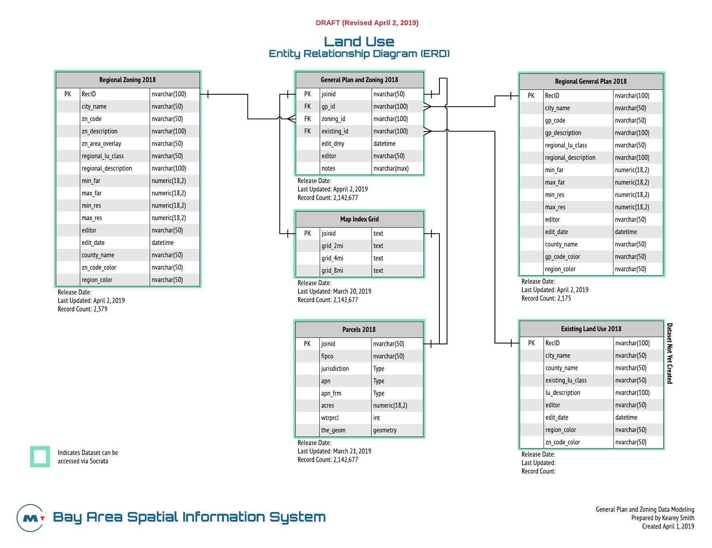

-- Draft --
# Regional Land Use Data

## Description
MTC collects land use data from local jurisdictions for use in the development of regional growth strategies, and long range transportation planning efforts. These Land Use Policies are designated by local jurisdictions to manage future development and growth within their respective jurisdictions.

## Purpose and Use  
Used in MTC Land Use Modeling, Housing Policy and Long Range Planning Research.

## Data Collection
This data was compiled using local information collected from each of the 109 jurisdictions in the San Francisco Bay Area Region.  A Document inventory was developed to track key information collected and used to process this data for regional modeling and policy based uses.

### Regional General Plan and Zoning Document Inventory
This dataset is used to manage the collection of key documents used in the preparation of the Planning and Zoning 2018 dataset. It contains key information used to develop the Regional General Plan and Zoning Datasets such as source documents, maps and links to jurisdiction general plan and zoning documents. 

[Click Here to View the Inventory](https://data.bayareametro.gov/Land-Use/Regional-General-Plan-and-Zoning-Dataset-Inventory/akeh-uvij)   

### Regional Parcel Characteristics Inventory
Parcel Characteristics data was collected from Assessor's in each of the 9 Bay Area Counties. Many of the counties had fee schedules that would be prohibitively expensive if paid across each county. Fee waiver requests were made to 4 of the counties with the highest fees. Our team worked in close connection with the MTC/ABAG Deputy Executive Director to request fee waivers which required collaboration with the MTC Commission and ABAG Board members representing the counties where fee waivers were necessary. The table below provides a summary of the fees waived or paid to each county Assessor's Office. 

| Jurisdiction         | Fee        | Fee Waiver | Fee Schedule                                                |
|----------------------|------------|------------|-------------------------------------------------------------|
| Santa Clara County   | $49,680.00 | Yes        | https://mtcdrive.box.com/s/4i5x71nlvckw271es0ieq06p2u9buj1n |
| Solano County        | $48,156.04 | Yes        | https://mtcdrive.box.com/s/zci19umnvraj2mpt4zp9l6zhy4p43bvh |
| Alameda County       | $20,000.00 | Yes        | https://mtcdrive.box.com/s/vsyhyrkmoorg8qmoy193iod7khp3f3ul |
| Contra Costa County  | $19,700.00 | Yes        | https://mtcdrive.box.com/s/9jkz4e0id9lt57cu7sxo8r3ry054y8bq |
| San Mateo County     | $2,745.00  | No         | https://mtcdrive.box.com/s/chdtu5r3fciz9c71ssnder96g2t4b7ui |
| Marin County         | $270.00    | No         | https://mtcdrive.box.com/s/fo3ek687mj6oulhdfkodrvqf5a1lhsd5 |
| Sonoma County        | $80.00     | No         |                                                             |
| Napa County          | $63.00     | No         | https://mtcdrive.box.com/s/1zrzwb0njj5vxj9051qf885s4beb1uzi |
| San Francisco County | $-         | No         | https://mtcdrive.box.com/s/u94ono6bz0k1oqetdxa2gfqi5pvlsjkq |

More detailed information including contact information, fees, fee waiver status, and parcel characteristics information provided by each Assessor's Office can be found by following the link below. You must be a member of the Data & Visualization team to view this informaiton. 

[Click Here to View Parcel Characteristics Tracker](https://data.bayareametro.gov/Cadastral/Assessor-Parcel-Characteristics-Acquisition-Tracke/fdby-7aan) 

## Data Processing
This data is generated using a combination of sources and methods (mainly ArcGIS Spatial Processing and MSSQL Spatial Queries). The inital data processing was performed on the Top 20 jurisdictions in the region with the largest population.  Digital data was collected from these jurisdictions and processed using ArcGIS and MSSQL Server using a simple point in poly method which assigns land use codes to parcel geometry based upon the location of the polygon centroid of each parcel in relation to the land use polygons contained in the source spatial datasets for these jurisdictions. See the figure below for a high level view of the data processing that was performed. 

Further processing included direct parcel assignment of land use for both zoning and general plan designations as presented on local jurisdiction planning documents, as well as using the assessor's parcel characteristics data for existing land uses on a given parcel, in most cases this is defined as use codes.  

## Datasets
Three datasets have been prepared using this process.  They are as follows:  

### Generalized Land Uses (Assessor's Parcel Use Codes)  
[Generalized Land Use]()   -- Not Yet Added  
Source: County Assessor's Parcel Characteristics that identify use code  

### General Plan
[General Plan Codes](https://data.bayareametro.gov/Land-Use/Regional-General-Plan-Codes-2018/vzcc-dhby)  
[General Plan](https://data.bayareametro.gov/Land-Use/View-based-on-Regional-General-Plan-Codes-2018/cc3g-fj4w)   
[General Plan Map](https://data.bayareametro.gov/Land-Use/DRAFT-General-Plan-Map/v22a-gxbu)  
Source: Local Jurisdiction Planning Documents  

### Zoning  
[Regional Zoning Codes](https://data.bayareametro.gov/Land-Use/Regional-Zoning-Codes-2018/qdrp-c5ra)  
[Regional Zoning](https://data.bayareametro.gov/Land-Use/View-of-Parcels-and-Regional-Zoning-2018/q2p6-hbrp)  
[Regional Zoning Map](https://data.bayareametro.gov/Land-Use/-DRAFT-Santa-Clara-County-Map-of-Regional-Zoning-2/rw5f-hgez)  
Source: Local Jurisdiction Planning Documents, Assessor's Parcel Characteristics for zoning  

**Figure 1. Data Processing Steps**

#### Entity Relationship Diagram and Attribute Definitions
The documentation and metadata details for this data can be viewed here: [General Plan and Zoning 2018](https://mtc.data.socrata.com/Land-Use/General-Plan-and-Zoning-2018/udk3-z2d5)  

**Figure 2. Entity Relationship Diagram**
  
Click [Here](https://www.lucidchart.com/documents/view/1fe3f1ba-8879-428e-8eb6-66157baf78b7/1) for interactive versions of Figures 1 and 2.

**Note**:
Attribute Definitions can be viewed [Here](https://mtc.data.socrata.com/Land-Use/General-Plan-and-Zoning-2018/udk3-z2d5).

This data is related to the [Parcels 2018 Dataset](https://mtc.data.socrata.com/Cadastral/Region-Parcels-2018-/fqea-xb6g) table using the joinid field.

Data Steward: DataViz Team
