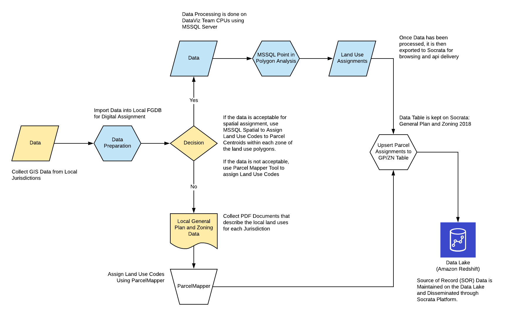

-- Draft --
# Regional General Plan

## Description
Land Use Policies designated by local jurisdictions to manage future development and growth within their respective jurisdictions.

## Purpose and Use  
Used in MTC Land Use Modeling, Housing Policy and Long Range Planning Research.

## Data Collection
This data was compiled using local information collected from each of the 109 jurisdictions in the San Francisco Bay Area Region.  A Document inventory was developed to track key information collected and used to process this data for regional modeling and policy based uses.

### Regional General Plan Zoning Document Inventory
This dataset is used to manage the collection of key documents used in the preparation of the Planning and Zoning 2018 dataset.  

[Click Here to View the Inventory](https://mtc.data.socrata.com/dataset/Regional_General_Plan_Zoning_Document_Inventory/akeh-uvij). 

Currently this view is private and for internal agency viewers exclusively and Requires Socrata Login Credentials to view.  Contact a DataViz Team Member Should you require access to this inventory list.  This list is also available to authenticated users of the BASIS System (Will be enabled soon). 

[Data Lens - Read Only](https://mtc.data.socrata.com/view/dwzg-k3ei)

## Data Processing
This data is generated using a combination of sources and methods (mainly ArcGIS Spatial Processing and MSSQL Spatial Queries). The figure below provides a high level overview of the data processing steps.  

Figure 1. BASIS Data Processing Overview

The inital data processing was performed on the Top 20 jurisdictions in the region with the largest population.  Digital data was collected from these jurisdictions and processed using ArcGIS and MSSQL Server using a simple point in poly method which assigns land use codes to parcel geometry based upon the location of the polygon centroid of each parcel in relation to the land use polygons contained in the source spatial datasets for these jurisdictions. See the figure below for a high level view of the data processing that was performed. 

Figure 2. Land Use Data Processing Steps

## Data Model and Attribute Definitions
The documentation and metadata details for this data can be viewed here: [General Plan and Zoning 2018](https://mtc.data.socrata.com/Land-Use/General-Plan-and-Zoning-2018/udk3-z2d5)

Note:
Attribute Definitions can be viewed using the link above.

This data is related to the [Parcels 2018 Dataset](https://mtc.data.socrata.com/Cadastral/Region-Parcels-2018-/fqea-xb6g) table using the joinid field.