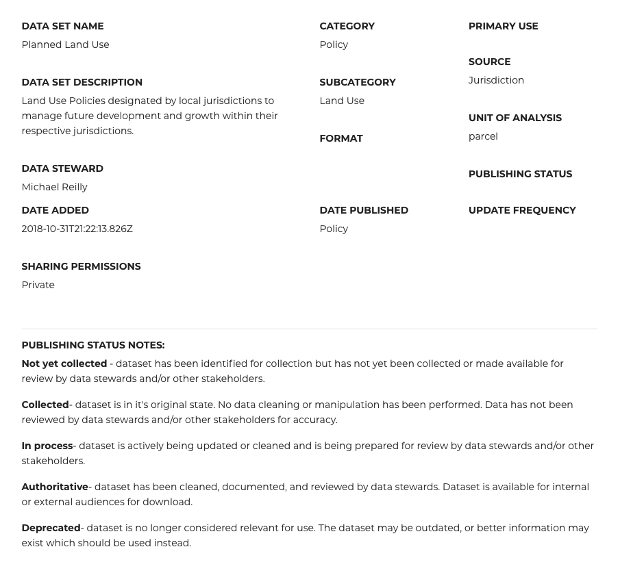

-- Draft --

# BASIS Master Data Management (MDM)
The following list identifies data that has been collected for the Bay Area Spatial Information System platform.  These datasets support MTC's Analytical Services and Long Range Planning efforts and drive decision making and policy development across the agency.  The data is managed by the Data & Visualization Team, with assistance from key staff that have been identified as Data Stewards in various units across the agency. Data is stored and managed within MTC's Enterprise Data Lake, and disseminated through the Socrata Connected Government Cloud Data as a Service (DaaS) Platform.  

The data is grouped into five primary categories, and includes the following descriptive attributes:  
 
The domain values for the list above include the following:
- Sharing Permissions Domains: Private/ Internal, Public/ External
- Category Domains: Policy, Transportation, Land & People, Administrative Boundaries, Environment
- Data Format Domains: Geographic, Tabular, Document
- Unit of Analysis Domains: County, City, Zip, Tract, Block, Parcel, etc.  

## Data Collection and Review Process
Most of the data that is collected for BASIS and included in the MDM has been identified for its usefulness when conducting policy based analytical work.  Much of the data comes from local jurisdictions in the nine county San Francisco Bay Area region, while a few datasets come from Federal, State or Local Agencies.  The following figure provides a high level overview of the BASIS Data Processing Flow.

**Figure 1. BASIS Data Processing Overview** 
  

The following list contains key datasets listed on the [BASIS Website](http://basis.bayareametro.gov/results) that have been marked for inclusion in the MDM Data Store.

### Administrative Boundaries
- [LAFCO SOI Boundaries]() -- Not Yet Added to Inventory
- [Jurisdiction Boundaries]() -- Not Yet Added to Inventory
- [Urban Service Areas]() -- Not Yet Added to Inventory

### Environment  

#### Tabulation Layers
- [Greenprint](redshift/greenprintFishnet.md) | [Data Processing Notes](https://www.bayareagreenprint.org/glossary/)
Table structure for data acquired from Bay Area Greenprint

### Policy
Includes data on Growth Management, State & Federal Law, Regional Policies, Environmental Justice, Planning and Zoning Land Uses.  

**Growth Management Boundaries and Policies**

- [Urban Growth Boundaries]() | [Data Processing Notes](policy-mdm/urban-growth-boundaries.md) -- Not Yet Added to Inventory
    - Includes both Urban Limit Lines and Growth Management Areas (Parcel Based)

**Land Uses**

#### Existing (From Assessor Parcels/ DataViz to Document)
- [Existing Land Use 2018]() | [Data Processing Notes](policy-mdm/land-use.md) -- Not Yet Added to Inventory

#### General Plan (From Local Jurisdictions) 
- [General Plan 2018]() | [Data Processing Notes](policy-mdm/land-use.md) -- Not Yet Added to Inventory

#### Zoning (From Local Jurisdictions)
- [Zoning 2018]() | [Data Processing Notes](policy-mdm/land-use.md) -- Not Yet Added to Inventory

- [General Plan and Zoning 2018](https://mtc.data.socrata.com/Land-Use/General-Plan-and-Zoning-2018/udk3-z2d5) 
 | [Data Processing Notes](policy-mdm/regional-general-plan.md)
 
 ##### UrbanSim Land Use
 - [Potential Land Use]()
#### Regional Policy Layers
- [Priority Development Areas (Parcel Based)]() -- Not Yet Added To Inventory
- [Transit Priority Areas (Parcel Based)]() -- Not Yet Added To Inventory  

### Land & People
Includes data that depicts local development, cadastral, buildings and structures and demography characteristics of local areas.

#### UrbanSim Datasets . 
Each of the following Datasets are related to the Assessor Parcel Records (Parcels 2018):  
- [Buildings](https://data.bayareametro.gov/Structures/Buildings/rrrx-2reu) | [Data Processing Notes](land-people-mdm/buildings.md)
- [Deed Restricted Units]() | [Data Processing Notes](land-people-mdm/deed-restricted-units.md) -- Not Yet Added to Inventory
- [Development Pipeline]() | [Data Processing Notes](land-people-mdm/development-pipeline.md) -- Not Yet Added to Inventory
- [Institutions]() | [Data Processing Notes](land-people-mdm/institutions.md) -- Not Yet Added to Inventory
- [Landmarks]() | [Data Processing Notes](land-people-mdm/landmarks.md) -- Not Yet Added to Inventory
- [Nondevelopment Sites]() | [Data Processing Notes](land-people-mdm/nondevelopmentsites.md) -- Not Yet Added to Inventory

#### Cadastral

- [Parcels 2018](https://mtc.data.socrata.com/Cadastral/Region-Parcels-2018-/fqea-xb6g) | [Data Processing Notes]()
- [Parcels 2015]() -- Not Yet Added To Inventory
- [Parcels 2010]() -- Not Yet Added To Inventory

##### UrbanSim Datasets
- [UrbamSim Parcels]() -- Not Yet Added To Inventory

#### Housing
- [Residential Permits]() | [Data Processing Notes](land-people-mdm/residential-permits.md) -- Not Yet Added to Inventory

### Transportation
Includes data that depicts and describes the region's Transportation Systems

#### Transit

[Regional Transit Database](https://github.com/bayareametro/RegionalTransitDatabase)   
Source: Transit Operators (via MTC 511)    
Input: [Google Transit Feed Specification](https://developers.google.com/transit/gtfs/) Text Files    
Output: Multiple, Bus Frequency by Geometry    
Dependencies: ~SQL Server~, Python, R, GDAL

- [Transit Stops]() -- Not Yet Added To Inventory  
- [Transit Lines]() -- Not Yet Added To Inventory  
