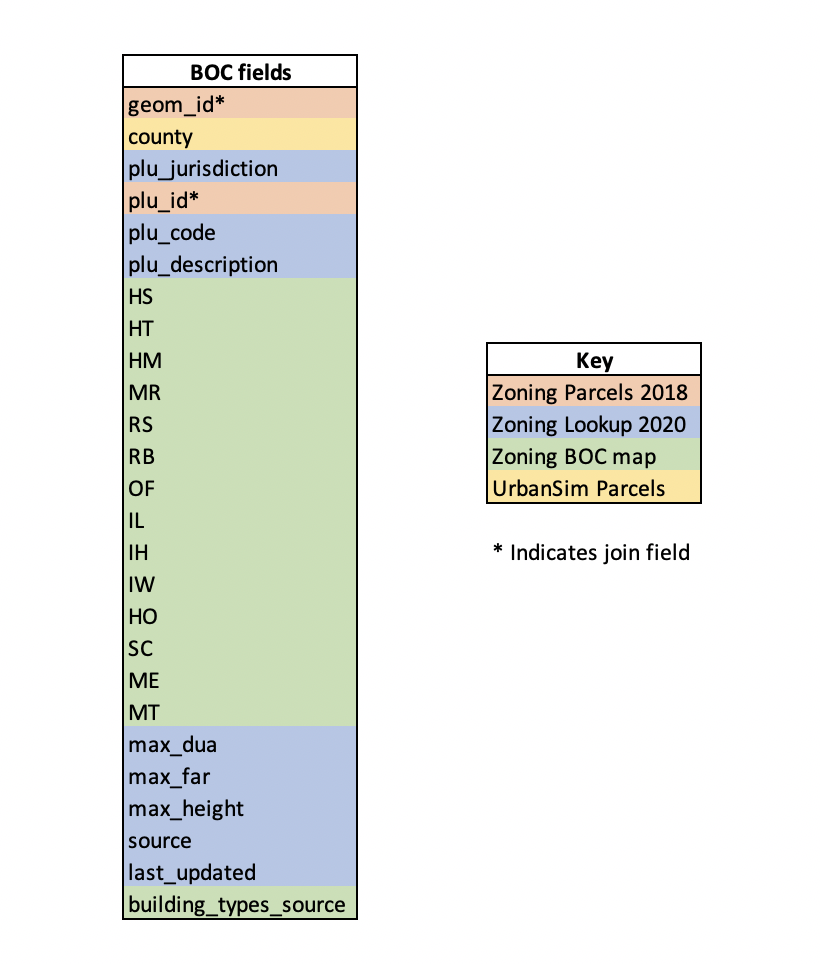

-- Draft --

# Build Out Capacity 

## Description
Based upon local jurisdiction zoning, general plan and build out information determined by jurisdiction staff within the nine county Bay Area region.  

## Purpose and Use  
Used in MTC Land Use Modeling, Housing Policy and Long Range Planning Research.

## Data Collection
This data was compiled using local information collected from each of the 109 jurisdictions in the San Francisco Bay Area Region.  {Discuss Data Collection Effort Here}

## Data Processing
This data is generated using a combination of sources and methods. The figure below provides a high level overview of the data processing steps.  

[**Data Processing Folder**](https://mtcdrive.app.box.com/folder/107214858288) (available internally at MTC only)

## Field Definitions and Sources

**Figure 1. Field Definitions and Sources**

## Related Datasets

-[Zoning Lookup 2020](https://data.bayareametro.gov/Land-Use/Zoning-Lookup-2020/r3pf-wkks)
-[Zoning Parcels 2018](https://data.bayareametro.gov/Land-Use/Zoning-Parcels-2018/c2b7-6c8p)
-[Zoning UrbanSim BOC Map](https://data.bayareametro.gov/UrbanSim/Zoning-UrbanSim-BOC-Map/m93e-tddx)

**Figure 2. Entity Relationship Diagram**

**Data Steward:** UrbanSim Team  
