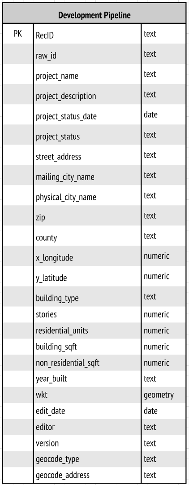

# Development Pipeline

## Description
Includes major permitted commercial, residential, and industrial development projects. Is comprised of a list of building projects recently completed, under construction, or approved.

## Project Management

- [Box](https://mtcdrive.box.com/s/zhrj6w8rle80mjyrez6v6s0fsu1yen35)

## Purpose and Use  
Used in MTC Land Use Modeling, Housing Policy and Long Range Planning Research.

## Local Jurisdiction Documentation and Data Sources

* **Alameda County**
   * Alameda County Development Pipeline Field Documentation (**Not Currently Available**)
* **Contra Costa County**
   * Contra Costa County Development Pipeline Field Documentation (**Not Currently Available**)
* **Marin County**
   * Marin County Development Pipeline Field Documentation (**Not Currently Available**)
* **Napa County**
   * Napa County Development Pipeline Field Documentaiton (**Not Currently Available**)
* **San Francisco County**
   * [San Francisco County Development Pipeline Field Documentation](https://mtcdrive.box.com/s/b1k5nturqhafihh9tlc8vi4pyvvmexld)
* **San Mateo County**
   * San Mateo County Development Pipeline Field Documentation (**Not Currently Available**)
* **Santa Clara County**
   * [Santa Clara County Development Pipeline Field Documentation](https://mtcdrive.box.com/s/r4jh6f95zukfquoujwr247znt0lj1xl2)
* **Solano County**
   * Solano County Development Pipeline Field Documentation (**Not Currently Available**)
* **Sonoma County**
   * [Sonoma County Development Pipeline Field Documentation](https://mtcdrive.box.com/s/5u7i2ga05sk6tf2aa6a96kfbd64e8c48)

## Data Collection
This data was compiled using local information collected from jurisdictions that participated in the BASIS Local Jurisdiction Review process as well as from congestion management agencies. 

The DataViz team coordinated closely Bay Area CMAs to collect major residential and commercial development projects for all cities within the jurisdiction of the following agencies:

* Santa Clara Valley Transportation Authority
* Sonoma County Transportation Authority

## Data Processing
This data is generated using a combination of sources and methods, mainly leveraging python jupyter notebooks as well as some manual review and type coding work using CSVs. The figure below provides a high level overview of the data processing steps.  

**Figure 1. Data Processing Steps**
 -- Lucidcharts 

## Field Definition and Sources

[Field Documentation](https://mtcdrive.box.com/s/slp5kwmta11sp5apkdxwbe2gyqgarz97) (**NOTE:** Field documentation available internally at MTC only)

**Figure 2. Entity Relationship Diagram**

**Note**:
Attribute Definitions can be viewed [Here](). -- Socrata

Data Steward: UrbanSim Team